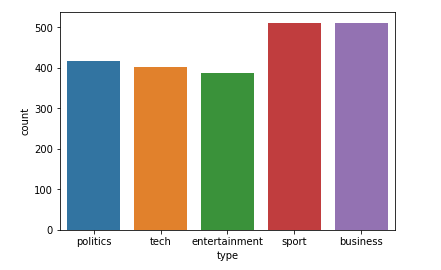
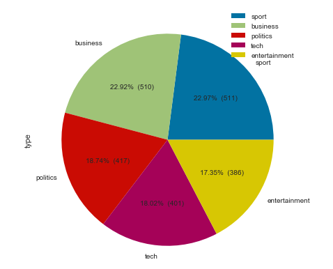
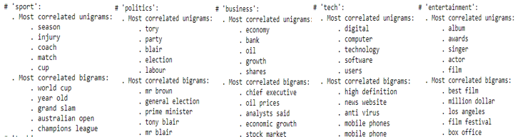
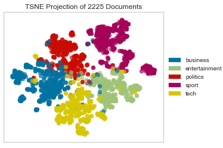
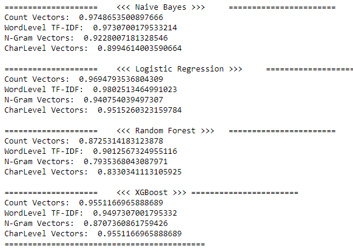
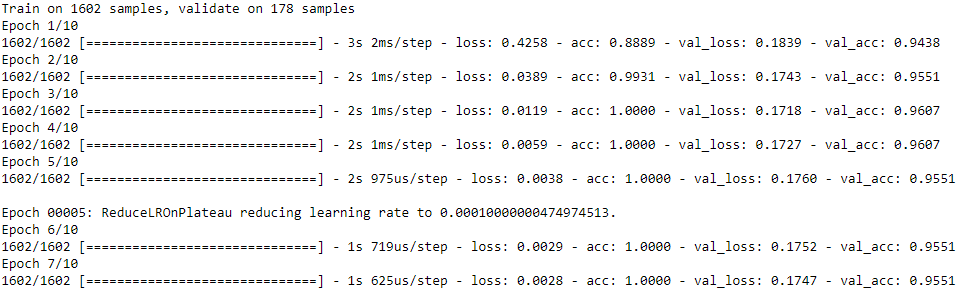
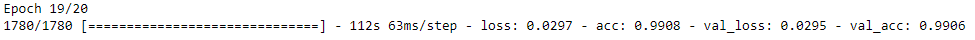
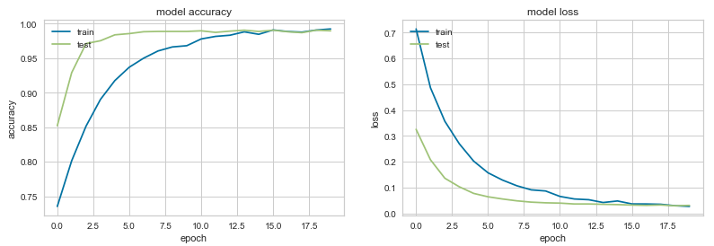
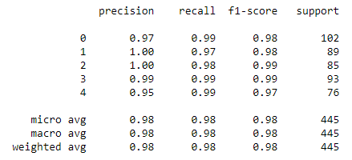

# News-Article-Classification-BBC
Classifying the Given Article to one of the 5 classes in BBC Using the *BERT* ,*Glove* ,*ML* Algorithms

It is a public dataset from the BBC comprised of 2225 articles, each labeled under one of 5 categories: business, entertainment, politics, sport or tech.

The dataset is broken into 1490 records for training and 735 for testing. The goal will be to build a system that can accurately classify previously unseen news articles into the right category.

## Classes information
#### Bar Chart

#### Pie Chart

## Highly correlated words

## TSNE Data Visualization
### data distribution

## Model Accuracies
### Ml Algorithms

### Neural networks

## Neural networks with "Glove Embeddings"

#### accuracy plot [NN-GLove]

## BERT Model
#### performance details

